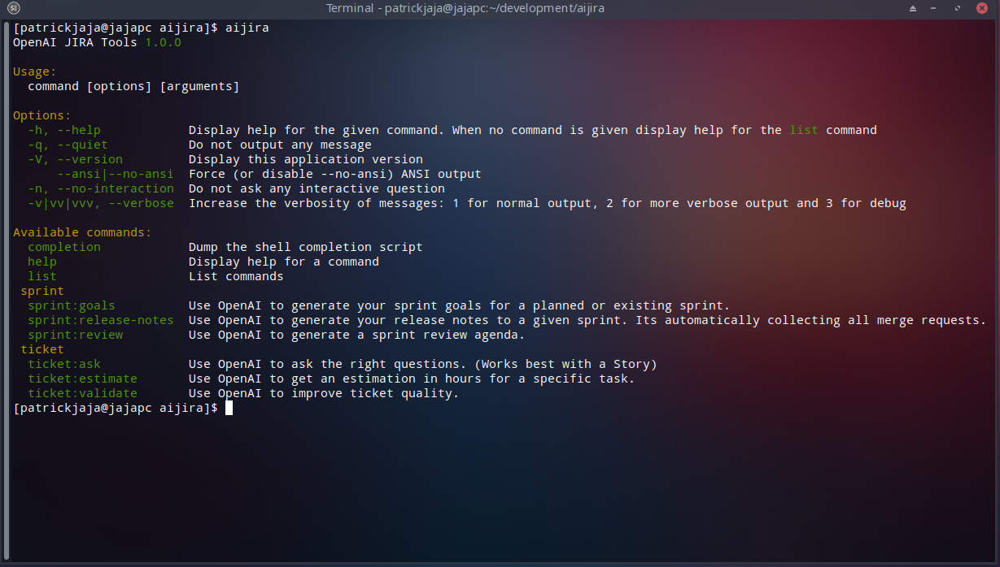

# aijira
Automization for regular project related tasks - no developer likes.



## Usage
```bash
> aijira <COMMAND>
```

## Setup
```
composer global config repositories.gitlab.nxs360.com/460 '{"type": "composer", "url": "https://gitlab.nxs360.com/api/v4/group/460/-/packages/composer/packages.json"}'
composer global require valantic/aijira
```

- Retrieve your [OpenAI API Key](https://platform.openai.com/account/api-keys)
- Retrieve your [Jira API Key](https://id.atlassian.com/manage-profile/security/api-tokens)
- Retrieve your [Gitlab Access Token](https://gitlab.nxs360.com/-/profile/personal_access_tokens)

## Configuration
The following env parameters need to be configured, depending on CLI commands you like to use (just configure them all):

### General Environment Variables
- OPENAI_KEY
## `aisprintgoals, aiticketvalidator, aiticketestimate, aiticketinterview`
- AI_JIRA_EMAIL (i.e. schoenfeld@nexus-netsoft.com)
- AI_JIRA_API_TOKEN (i.e. ATATT3xF...)
- AI_JIRA_URL (i.e. https://lr4digital.atlassian.net/)
- AI_JIRA_PROJECT (i.e. SPRY)
- AI_JIRA_BOARD_ID (i.e. 10)
## `aisprintreview`
- AI_GITLAB_URL (i.e. https://gitlab.nxs360.com/)
- AI_GITLAB_TOKEN (i.e. 9s6h...)
- AI_GITLAB_PROJECT_IDS (i.e. 476,735)

## Examples

### Use OpenAI to generate your sprint goals for a planned or existing sprint.
```bash
> aijira sprint:goals "Spryker Sprint 20"
```


### Use OpenAI to generate a sprint review agenda.
```bash
> aijira sprint:review "Spryker Sprint 20"
```


### Use OpenAI to ask the right questions. (Works best with a Story)
```bash
> aijira ticket:ask "SPRY-1262"
```


### Use OpenAI to get an estimation in hours for a specific task.
```bash
> aijira ticket:estimate "SPRY-1899"
```


### Use OpenAI to improve ticket quality.
```bash
> aijira ticket:validate "SPRY-661"
```


### Use OpenAI to generate your release notes to a given sprint. Its automatically collecting all merge requests.
```bash
> aijira sprint:release-notes "Spryker Sprint 20"
```


## ToDo
- [x] `aijira-ticket-validate "Ticket No"` Ticket Quality Checker "Ticket NR"
- [x] `aijira-ticket-estimate "Ticket No"` Automatische Estimations (Only Tasks)
- [x] `aijira-sprint-review-generate "Sprint Name"` Sprint Review Ticket List generator "DateRange"
- [x] `aijira-ticket-interview "Ticket No"` Ticket/Story Interview Questions to productowner (`Liste die Fragen für das Benutzerinterview für das folgende Feature auf: [Feature beschreiben]`)
- [ ] `aijira-ticket-acceptance-criteria "Ticket No"` Auto ACs
- [ ] `aijira-ticket-test-cases "Ticket No"` Testcase generator "Ticket NR"
- [ ] `aijira-gitlab-release-notes "Sprint Name"` Auto release notes gitlab > CHANGELOG-2023-06-15.md
- perfect prompt gpt4 plugin -> improve our prompts
- [x] symfony console aijira wrapper to for ai commands, its usage and description