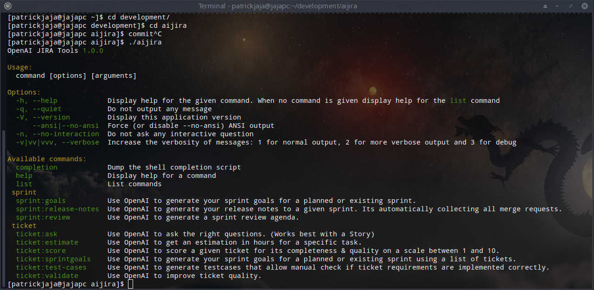

# aijira
Automization for regular project related tasks - no developer likes.



## Usage
```bash
> aijira <COMMAND>
```

## Setup
```
composer global require valantic-cec/aijira
```

- Retrieve your [OpenAI API Key](https://platform.openai.com/account/api-keys)
- Retrieve your [Jira API Key](https://id.atlassian.com/manage-profile/security/api-tokens)
- Retrieve your [Gitlab Access Token](https://gitlab.nxs360.com/-/profile/personal_access_tokens)

## Configuration
The following env parameters need to be configured, depending on CLI commands you like to use (just configure them all):

### General Environment Variables
- OPENAI_KEY
## `aisprintgoals, aiticketvalidator, aiticketestimate, aiticketinterview`
- AI_JIRA_EMAIL (i.e. schoenfeld@nexus-netsoft.com)
- AI_JIRA_API_TOKEN (i.e. ATATT3xF...)
- AI_JIRA_URL (i.e. https://nexus-netsoft.atlassian.net/)
- AI_JIRA_PROJECT (i.e. SPRY)
- AI_JIRA_BOARD_ID (i.e. 10)
## `aisprintreview, aireleasenotes`
- AI_GITLAB_URL (i.e. https://gitlab.nxs360.com/)
- AI_GITLAB_TOKEN (i.e. 9s6h...)
- AI_GITLAB_PROJECT_IDS (i.e. 476,735)

## Examples

### Use OpenAI to generate your sprint goals for a planned or existing sprint.
```bash
> aijira sprint:goals "<SPRINT-NAME>"
```


### Use OpenAI to generate a sprint review agenda.
```bash
> aijira sprint:review "<SPRINT-NAME>"
```


### Use OpenAI to ask the right questions. (Works best with a Story)
```bash
> aijira ticket:ask "<TICKET-NR>"
```


### Use OpenAI to get an estimation in hours for a specific task.
```bash
> aijira ticket:estimate "<TICKET-NR>"
```


### Use OpenAI to score a given ticket for its completeness & quality on a scale between 1 and 10.
```bash
> aijira ticket:score "<TICKET-NR>"
```


### Use OpenAI to improve ticket quality.
```bash
> aijira ticket:validate "<TICKET-NR>"
```


### Use OpenAI to generate test-cases
```bash
> aijira ticket:test-cases "<TICKET-NR>"
```


### Use OpenAI to generate your release notes to a given sprint. Its automatically collecting all merge requests.
```bash
> aijira sprint:release-notes "<SPRINT-NAME>"
```


### Use OpenAI to generate testcases that allow manual check if ticket requirements are implemented correctly.
```bash
> aijira ticket:test-cases "<SPRINT-NAME>"
```


## ToDo
None, code is perfect ;)
